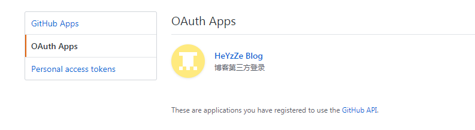
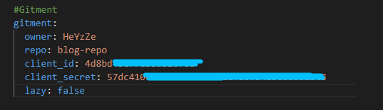

# Gitment评论功能与踩坑
***注意：***<mark>本文中的方法使用的服务代理协议已过期，浏览器会报警告。如需正常使用还需自己搭建代理服务器</mark>

<!-- more -->

# 开启github三方登录
在GitHub中设置里打开OAuth Apps，新增一项。
```
Application name: 名称，随便
Homepage URL: 首页地址，随便
Application description: 描述，随便
Authorization callback URL: 回调地址，博客地址
```
成功后如下

将生成的client_id，client_secret配置到博客配置中

```yaml
owner: HeYzZe // GitHub用户名
repo: blog-repo // 评论记录存储库名
client_id: * 
client_secret: *
lazy: false // 是否懒加载评论内容
```
`owner` -- GitHub用户名也可以是GitHub用户id，推荐使用用户名
`repo` -- 缓存评论内容地址名称，可以是博客的地址，也可以新建一个库，这里是库的***名称***
